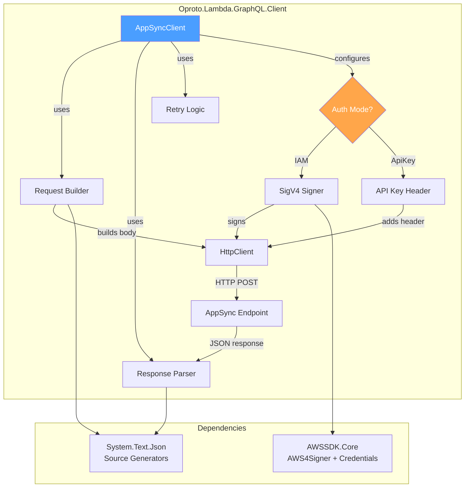
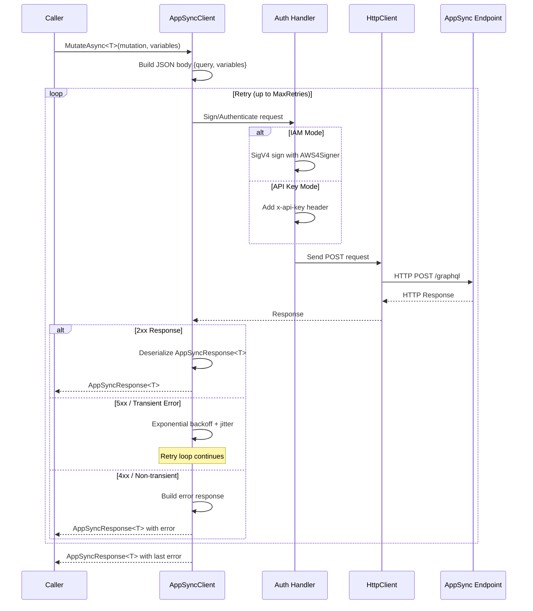

# Design Document: AppSync Mutation Client

## Overview

The `Oproto.Lambda.GraphQL.Client` package provides a lightweight HTTP client for sending GraphQL operations (mutations and queries) to AWS AppSync endpoints from backend processes. The primary use case is triggering AppSync subscriptions by calling mutations from EventBridge handlers, SQS processors, and other Lambda functions.

The client is completely independent of the Runtime and SourceGenerator packages. It depends only on `AWSSDK.Core` (for SigV4 credential resolution) and `System.Text.Json` (for AOT-compatible serialization). It supports two authentication modes: IAM (SigV4) and API Key.

This is not a full GraphQL client framework — there is no caching, no WebSocket subscription support, and no schema introspection. It is a thin HTTP wrapper that sends GraphQL operations as HTTP POST requests with proper authentication.

### Key Design Decisions

1. **SigV4 signing via AWSSDK.Core**: Rather than implementing our own SigV4 signer, we use the `AWS4Signer` from `AWSSDK.Core`. This keeps us aligned with AWS SDK updates and handles credential refresh, STS assume-role, etc.

2. **Result-based error handling**: The client returns `AppSyncResponse<TResult>` rather than throwing exceptions for GraphQL-level errors. HTTP-level failures and network errors after retry exhaustion are also returned as structured error responses, not exceptions. Only configuration errors (null endpoint) throw during construction.

3. **Caller-owned HttpClient**: The client accepts an optional `HttpClient` via options for connection reuse and testability. When not provided, it creates and owns one internally. The `IDisposable` pattern only disposes internally-created clients.

4. **AOT-first serialization**: All internal types have `[JsonSerializable]` registrations. Callers can supply their own `JsonSerializerContext` for custom `TResult` and variables types. Without one, the client falls back to default `System.Text.Json` with `camelCase` naming.

5. **Exponential backoff with jitter**: Retry logic uses exponential backoff with random jitter for transient failures (5xx, timeouts, `HttpRequestException`). 4xx errors are never retried.

## Architecture



### Request Flow



## Components and Interfaces

### Project Structure

```
Oproto.Lambda.GraphQL.Client/
├── AppSyncClient.cs                    # Main client class (IDisposable)
├── AppSyncClientOptions.cs             # Configuration options
├── AppSyncResponse.cs                  # Response wrapper with Data + Errors
├── GraphQLError.cs                     # GraphQL error model
├── GraphQLErrorLocation.cs             # Error location (line/column)
├── AuthMode.cs                         # Enum: Iam, ApiKey
├── AppSyncClientException.cs           # Exception for non-recoverable failures
├── Serialization/
│   └── AppSyncClientJsonContext.cs     # Internal JsonSerializerContext
└── Oproto.Lambda.GraphQL.Client.csproj
```

### Public API Surface

#### `AppSyncClient` (main class)

```csharp
namespace Oproto.Lambda.GraphQL.Client;

public sealed class AppSyncClient : IDisposable
{
    public AppSyncClient(AppSyncClientOptions options);
    public AppSyncClient(AppSyncClientOptions options, ILogger<AppSyncClient>? logger);

    public Task<AppSyncResponse<TResult>> SendAsync<TResult>(
        string query,
        object? variables = null,
        CancellationToken cancellationToken = default);

    public Task<AppSyncResponse<TResult>> MutateAsync<TResult>(
        string mutation,
        object? variables = null,
        CancellationToken cancellationToken = default);

    public Task<AppSyncResponse<TResult>> QueryAsync<TResult>(
        string query,
        object? variables = null,
        CancellationToken cancellationToken = default);

    public void Dispose();
}
```

`MutateAsync` and `QueryAsync` are convenience wrappers that delegate directly to `SendAsync`. They exist for readability at call sites — the HTTP mechanism is identical.

#### `AppSyncClientOptions`

```csharp
namespace Oproto.Lambda.GraphQL.Client;

public class AppSyncClientOptions
{
    public required string Endpoint { get; set; }
    public AuthMode AuthMode { get; set; } = AuthMode.Iam;
    public string? ApiKey { get; set; }
    public string? Region { get; set; }  // defaults to AWS_REGION env var
    public int MaxRetries { get; set; } = 3;
    public HttpClient? HttpClient { get; set; }
    public JsonSerializerContext? JsonSerializerContext { get; set; }
}
```

#### `AuthMode`

```csharp
namespace Oproto.Lambda.GraphQL.Client;

public enum AuthMode
{
    Iam,
    ApiKey
}
```

#### `AppSyncResponse<TResult>`

```csharp
namespace Oproto.Lambda.GraphQL.Client;

public class AppSyncResponse<TResult>
{
    public TResult? Data { get; set; }
    public List<GraphQLError>? Errors { get; set; }
    public bool HasErrors => Errors is { Count: > 0 };
    public bool IsSuccess => Data is not null && !HasErrors;

    // For HTTP-level failures (non-200, non-GraphQL responses)
    public int? StatusCode { get; set; }
    public string? RawBody { get; set; }
    public Exception? Exception { get; set; }
}
```

#### `GraphQLError`

```csharp
namespace Oproto.Lambda.GraphQL.Client;

public class GraphQLError
{
    public string? Message { get; set; }
    public string? ErrorType { get; set; }
    public List<string>? Path { get; set; }
    public List<GraphQLErrorLocation>? Locations { get; set; }
}

public class GraphQLErrorLocation
{
    public int Line { get; set; }
    public int Column { get; set; }
}
```

### Internal Components

#### SigV4 Signing

The client uses `Amazon.Runtime.Internal.Auth.AWS4Signer` from AWSSDK.Core to sign requests when `AuthMode.Iam` is configured. Credentials are resolved via `FallbackCredentialsFactory.GetCredentials()` which follows the standard AWS credential chain (environment variables → IAM role → instance profile).

The signing flow:
1. Build the `HttpRequestMessage` with the JSON body
2. Create an `ImmutableCredentials` from the resolved credentials
3. Use `AWS4Signer` to compute the signature over the request (including body)
4. Add the `Authorization`, `X-Amz-Date`, and optionally `X-Amz-Security-Token` headers

#### Retry Logic

```csharp
// Internal retry implementation
// Base delay: 100ms, multiplied by 2^attempt, with random jitter ±50%
// Attempt 0: ~100ms, Attempt 1: ~200ms, Attempt 2: ~400ms
private static TimeSpan CalculateDelay(int attempt)
{
    var baseDelay = TimeSpan.FromMilliseconds(100 * Math.Pow(2, attempt));
    var jitter = Random.Shared.NextDouble() * baseDelay.TotalMilliseconds;
    return baseDelay + TimeSpan.FromMilliseconds(jitter - baseDelay.TotalMilliseconds / 2);
}
```

Transient failures that trigger retry:
- HTTP 5xx status codes
- `TaskCanceledException` (request timeout, not caller cancellation)
- `HttpRequestException` (network errors)

Non-retryable:
- HTTP 4xx status codes
- `OperationCanceledException` when the caller's `CancellationToken` is cancelled
- Successful responses (2xx), even if they contain GraphQL errors

#### Serialization

```csharp
// Internal JSON context for request/response models
[JsonSerializable(typeof(GraphQLRequestBody))]
[JsonSerializable(typeof(AppSyncResponseEnvelope))]
[JsonSerializable(typeof(GraphQLError))]
[JsonSerializable(typeof(GraphQLErrorLocation))]
[JsonSerializable(typeof(List<GraphQLError>))]
internal partial class AppSyncClientJsonContext : JsonSerializerContext { }

// Internal request body model
internal class GraphQLRequestBody
{
    public string Query { get; set; } = string.Empty;

    [JsonIgnore(Condition = JsonIgnoreCondition.WhenWritingNull)]
    public object? Variables { get; set; }
}
```

When a caller-supplied `JsonSerializerContext` is provided:
- Variables serialization uses the caller's context
- Response `data` field deserialization uses the caller's context
- Internal types (request envelope, error models) always use the internal context

When no caller context is provided:
- Default `System.Text.Json` serialization with `JsonSerializerOptions { PropertyNamingPolicy = JsonNamingPolicy.CamelCase }`

### Project Configuration

```xml
<Project Sdk="Microsoft.NET.Sdk">
  <PropertyGroup>
    <TargetFrameworks>net8.0;net10.0</TargetFrameworks>
    <ImplicitUsings>enable</ImplicitUsings>
    <PackageId>Oproto.Lambda.GraphQL.Client</PackageId>
    <AssemblyName>Oproto.Lambda.GraphQL.Client</AssemblyName>
    <RootNamespace>Oproto.Lambda.GraphQL.Client</RootNamespace>
    <Description>Lightweight AppSync HTTP client for sending GraphQL mutations and queries with IAM SigV4 and API Key authentication</Description>
    <PackageTags>aws;lambda;graphql;appsync;client;mutation;sigv4</PackageTags>
  </PropertyGroup>

  <ItemGroup>
    <PackageReference Include="AWSSDK.Core" Version="4.0.3.14" />
    <PackageReference Include="Microsoft.Extensions.Logging.Abstractions" Version="8.0.0" />
  </ItemGroup>

  <ItemGroup>
    <None Include="../README.md" Pack="true" PackagePath="\" />
  </ItemGroup>
</Project>
```

Note: `System.Text.Json` is included in the `net8.0` and `net10.0` shared frameworks, so no explicit package reference is needed. `Microsoft.Extensions.Logging.Abstractions` is added for the optional `ILogger` support.

### Test Project Structure

Tests will be added to the existing `Oproto.Lambda.GraphQL.Tests` project under a `Client/` subfolder, following the same pattern as `Runtime/`:

```
Oproto.Lambda.GraphQL.Tests/
├── Client/
│   ├── AppSyncClientTests.cs              # Unit tests for request construction, auth, response parsing
│   ├── AppSyncClientRetryTests.cs         # Retry behavior tests
│   ├── AppSyncClientDisposableTests.cs    # IDisposable behavior tests
│   ├── AppSyncResponsePropertyTests.cs    # Property-based round-trip tests
│   └── Generators/
│       └── GraphQLArbitraries.cs          # FsCheck generators for GraphQL types
└── Runtime/
    └── ... (existing)
```

## Data Models

### Request Body (Internal)

```csharp
internal class GraphQLRequestBody
{
    [JsonPropertyName("query")]
    public string Query { get; set; } = string.Empty;

    [JsonPropertyName("variables")]
    [JsonIgnore(Condition = JsonIgnoreCondition.WhenWritingNull)]
    public object? Variables { get; set; }
}
```

Serialized as:
```json
{
  "query": "mutation UpdateOrder($input: UpdateOrderInput!) { updateOrder(input: $input) { id status } }",
  "variables": { "input": { "id": "order-123", "status": "SHIPPED" } }
}
```

When `variables` is null, the field is omitted entirely from the JSON body.

### Response Envelope (Internal)

```csharp
// Used for initial deserialization before extracting typed data
internal class AppSyncResponseEnvelope
{
    [JsonPropertyName("data")]
    public JsonElement? Data { get; set; }

    [JsonPropertyName("errors")]
    public List<GraphQLError>? Errors { get; set; }
}
```

### GraphQL Error Model (Public)

```csharp
public class GraphQLError
{
    [JsonPropertyName("message")]
    public string? Message { get; set; }

    [JsonPropertyName("errorType")]
    public string? ErrorType { get; set; }

    [JsonPropertyName("path")]
    public List<string>? Path { get; set; }

    [JsonPropertyName("locations")]
    public List<GraphQLErrorLocation>? Locations { get; set; }
}

public class GraphQLErrorLocation
{
    [JsonPropertyName("line")]
    public int Line { get; set; }

    [JsonPropertyName("column")]
    public int Column { get; set; }
}
```

### AppSync Response (Public)

```csharp
public class AppSyncResponse<TResult>
{
    [JsonPropertyName("data")]
    public TResult? Data { get; set; }

    [JsonPropertyName("errors")]
    public List<GraphQLError>? Errors { get; set; }

    // Computed properties (not serialized)
    [JsonIgnore]
    public bool HasErrors => Errors is { Count: > 0 };

    [JsonIgnore]
    public bool IsSuccess => Data is not null && !HasErrors;

    // HTTP-level error info (populated by client, not from JSON)
    [JsonIgnore]
    public int? StatusCode { get; set; }

    [JsonIgnore]
    public string? RawBody { get; set; }

    [JsonIgnore]
    public Exception? Exception { get; set; }
}
```

### Configuration Model (Public)

```csharp
public class AppSyncClientOptions
{
    public required string Endpoint { get; set; }
    public AuthMode AuthMode { get; set; } = AuthMode.Iam;
    public string? ApiKey { get; set; }
    public string? Region { get; set; }
    public int MaxRetries { get; set; } = 3;
    public HttpClient? HttpClient { get; set; }
    public JsonSerializerContext? JsonSerializerContext { get; set; }
}

public enum AuthMode
{
    Iam,
    ApiKey
}
```
