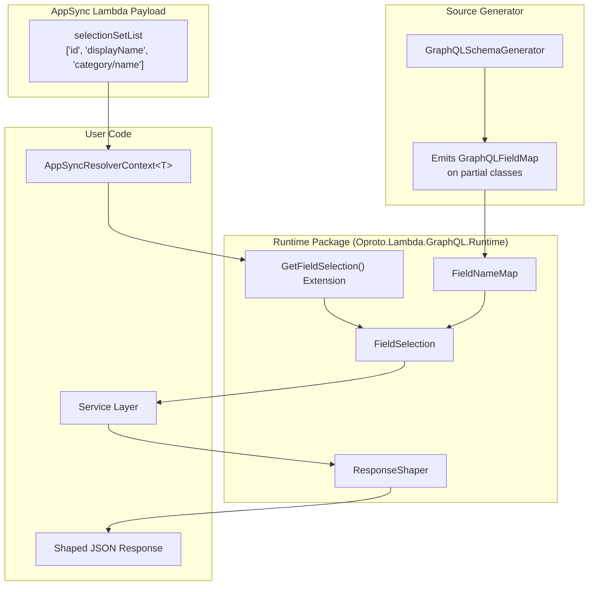

# Design Document: Field Selection Abstraction

## Overview

This design covers Layer 2 of the three-layer field selection architecture: a database-agnostic `FieldSelection` abstraction and supporting types that live in the `Oproto.Lambda.GraphQL.Runtime` package, plus source generator enhancements in `Oproto.Lambda.GraphQL.SourceGenerator`.

The feature introduces four core components:

1. **FieldSelection** — an immutable abstraction over the set of fields a GraphQL client requested, expressed in C# property names. Supports querying (`IsRequested`), nested type extraction (`ForNestedType`), and name translation (`MapWith`).
2. **FieldNameMap** — an immutable, composable mapping from one naming domain to another (e.g., GraphQL camelCase field names → C# PascalCase property names). Supports chaining via `Then()` for multi-layer architectures.
3. **Source generator enhancement** — emits a `GraphQLFieldMap` static property on each `[GraphQLType]` partial class, providing the GraphQL→C# name mapping at compile time with zero reflection.
4. **Response shaping** — a `ResponseShaper.ShapeResponse<T>()` utility that serializes an object to JSON and strips properties not present in the `FieldSelection`, handling naming policies and `[JsonPropertyName]` attributes.

The design deliberately excludes database-specific projection (Layer 3), which is covered by separate specs for FluentDynamoDB and raw DynamoDB SDK integration.

### Key Design Decisions

**FieldSelection.All() semantics**: `All()` returns an instance with an empty `Fields` set and `IsAll = true`. This represents "no filtering — all fields requested." Any `IsRequested()` call on an `All()` instance returns `true`. This is the default when the selection set is null/empty, ensuring safe fallback behavior.

**FieldNameMap composition**: Maps compose left-to-right via `Then()`. Given `map1: A→B` and `map2: B→C`, `map1.Then(map2)` produces `A→C`. Unmapped names pass through unchanged at each stage. This supports multi-assembly architectures where GraphQL types, service models, and database entities live in separate projects.

**Response shaping approach**: `ShapeResponse<T>()` serializes the full object first, then filters the JSON DOM. This is intentional — the developer may need to compute all fields (for authorization, computed fields, etc.) but only return the requested subset. The method accepts `JsonSerializerOptions` to respect the project's naming policy and `[JsonPropertyName]` overrides.

**Source generator scope**: The generator emits `FieldNameMap` only for `[GraphQLType]` classes (not inputs, enums, or unions). It maps entries only where the GraphQL field name differs from the C# property name. When all names match, it emits `FieldNameMap.Identity`.

## Architecture



### Data Flow

1. AppSync sends `selectionSetList` in the resolver context payload
2. Lambda function receives `AppSyncResolverContext<T>` (already implemented in Spec 1)
3. Developer calls `ctx.GetFieldSelection()` or `ctx.GetFieldSelection(Product.GraphQLFieldMap)` to get a `FieldSelection` with C# property names
4. `FieldSelection` flows through the service layer — methods check `selection.IsRequested("Price")` to skip expensive work
5. For nested types, `selection.ForNestedType("Category")` extracts the sub-selection
6. At the response boundary, `ResponseShaper.ShapeResponse(product, selection)` serializes and filters the JSON output

### Package Placement

| Component | Package | TFM |
|-----------|---------|-----|
| `FieldSelection` | `Oproto.Lambda.GraphQL.Runtime` | net6.0;net8.0;net10.0 |
| `FieldNameMap` | `Oproto.Lambda.GraphQL.Runtime` | net6.0;net8.0;net10.0 |
| `ResponseShaper` | `Oproto.Lambda.GraphQL.Runtime` | net6.0;net8.0;net10.0 |
| `GetFieldSelection()` extension | `Oproto.Lambda.GraphQL.Runtime` | net6.0;net8.0;net10.0 |
| `GraphQLFieldMap` emission | `Oproto.Lambda.GraphQL.SourceGenerator` | netstandard2.0 |

## Components and Interfaces

### FieldSelection

```csharp
namespace Oproto.Lambda.GraphQL.Runtime;

/// <summary>
/// Represents the set of fields requested by a GraphQL client, using C# property names.
/// Immutable and safe to pass across layers.
/// </summary>
public sealed class FieldSelection
{
    // Private constructor — use factory methods
    private FieldSelection(IReadOnlySet<string> fields, bool isAll,
        IReadOnlyDictionary<string, List<string>>? nestedPaths);

    /// <summary>
    /// The set of top-level C# property names requested. Empty when IsAll is true.
    /// </summary>
    public IReadOnlySet<string> Fields { get; }

    /// <summary>
    /// True when all fields are requested (no filtering). Created via All() or
    /// when the selection set is null/empty.
    /// </summary>
    public bool IsAll { get; }

    // --- Factory Methods ---

    /// <summary>
    /// Creates a FieldSelection representing "all fields requested" (no filtering).
    /// </summary>
    public static FieldSelection All();

    /// <summary>
    /// Parses an AppSync selectionSetList into a FieldSelection using top-level field names.
    /// Returns All() when the list is null or empty.
    /// </summary>
    public static FieldSelection FromSelectionSet(List<string>? selectionSetList);

    /// <summary>
    /// Parses an AppSync selectionSetList and maps field names through the provided map.
    /// </summary>
    public static FieldSelection FromSelectionSet(List<string>? selectionSetList, FieldNameMap map);

    /// <summary>
    /// Creates a FieldSelection from explicit field names.
    /// </summary>
    public static FieldSelection Of(params string[] fields);

    // --- Query Methods ---

    /// <summary>
    /// Returns true if the named field was requested, or if IsAll is true.
    /// </summary>
    public bool IsRequested(string propertyName);

    /// <summary>
    /// Extracts the sub-selection for a nested object field.
    /// Returns All() if the field was requested without specific sub-fields,
    /// or if this FieldSelection IsAll.
    /// </summary>
    public FieldSelection ForNestedType(string propertyName);

    // --- Mapping ---

    /// <summary>
    /// Returns a new FieldSelection with all field names translated through the map.
    /// </summary>
    public FieldSelection MapWith(FieldNameMap map);
}
```

### FieldNameMap

```csharp
namespace Oproto.Lambda.GraphQL.Runtime;

/// <summary>
/// Immutable mapping from source names to target names.
/// Composable via Then() for multi-layer architectures.
/// </summary>
public sealed class FieldNameMap
{
    private readonly IReadOnlyDictionary<string, string> _mappings;

    private FieldNameMap(IReadOnlyDictionary<string, string> mappings);

    /// <summary>
    /// Identity map — every name maps to itself.
    /// </summary>
    public static FieldNameMap Identity { get; }

    /// <summary>
    /// Creates a new builder for constructing a FieldNameMap.
    /// </summary>
    public static FieldNameMapBuilder Builder();

    /// <summary>
    /// Maps a source name to its target name. Returns the original name if no mapping exists.
    /// </summary>
    public string MapName(string sourceName);

    /// <summary>
    /// Composes this map with another: source → (this) → intermediate → (next) → target.
    /// </summary>
    public FieldNameMap Then(FieldNameMap next);
}

/// <summary>
/// Fluent builder for FieldNameMap.
/// </summary>
public sealed class FieldNameMapBuilder
{
    /// <summary>
    /// Adds a mapping from sourceName to targetName.
    /// </summary>
    public FieldNameMapBuilder Map(string sourceName, string targetName);

    /// <summary>
    /// Builds the immutable FieldNameMap.
    /// </summary>
    public FieldNameMap Build();
}
```

### ResponseShaper

```csharp
namespace Oproto.Lambda.GraphQL.Runtime;

/// <summary>
/// Filters serialized JSON output to include only fields present in a FieldSelection.
/// </summary>
public static class ResponseShaper
{
    /// <summary>
    /// Serializes the value to JSON and removes properties not in the selection.
    /// Uses default JsonSerializerOptions with CamelCase naming policy.
    /// </summary>
    public static string ShapeResponse<T>(T value, FieldSelection selection);

    /// <summary>
    /// Serializes the value to JSON and removes properties not in the selection,
    /// using the provided serializer options.
    /// </summary>
    public static string ShapeResponse<T>(T value, FieldSelection selection,
        JsonSerializerOptions options);
}
```

**Implementation approach for ResponseShaper**:

1. If `selection.IsAll`, serialize normally and return — no filtering needed.
2. If `value` is null, return `"null"`.
3. Serialize `value` to a `JsonDocument` using the provided (or default) options.
4. Walk the JSON DOM, building a new JSON string that includes only properties whose C# name is in the `FieldSelection`.
5. To match C# property names against serialized JSON names: build a reverse lookup from the serialized JSON property name back to the C# property name by applying the naming policy (and checking `[JsonPropertyName]` via reflection-free metadata from `JsonSerializerOptions.TypeInfoResolver`).

**Naming policy matching strategy**: The `ResponseShaper` needs to know which serialized JSON property name corresponds to which C# property name. It does this by:
- Getting the `JsonTypeInfo<T>` from the options' `TypeInfoResolver` (available in .NET 8+ via `options.GetTypeInfo(typeof(T))`)
- Iterating the `JsonPropertyInfo` entries which contain both the `Name` (serialized name) and the property metadata
- Building a `Dictionary<string, string>` from serialized name → C# property name
- For net6.0: falling back to applying the `PropertyNamingPolicy` to the C# property name to derive the expected serialized name

### AppSyncResolverContext Extension Methods

```csharp
namespace Oproto.Lambda.GraphQL.Runtime;

/// <summary>
/// Extension methods for extracting FieldSelection from AppSyncResolverContext.
/// </summary>
public static class AppSyncResolverContextExtensions
{
    /// <summary>
    /// Extracts a FieldSelection from the resolver context's selectionSetList.
    /// Returns FieldSelection.All() if info or selectionSetList is null/empty.
    /// </summary>
    public static FieldSelection GetFieldSelection<TArguments>(
        this AppSyncResolverContext<TArguments> context);

    /// <summary>
    /// Extracts a FieldSelection from the resolver context's selectionSetList,
    /// mapping field names through the provided FieldNameMap.
    /// </summary>
    public static FieldSelection GetFieldSelection<TArguments>(
        this AppSyncResolverContext<TArguments> context, FieldNameMap map);
}
```

### Source Generator: GraphQLFieldMap Emission

The existing `GraphQLSchemaGenerator` will be extended to emit a partial class file for each `[GraphQLType]` class containing a static `GraphQLFieldMap` property.

**Generated code example** for the `Product` class (which has `[GraphQLField("displayName")]` on `Name`):

```csharp
// <auto-generated/>
using Oproto.Lambda.GraphQL.Runtime;

namespace Oproto.Lambda.GraphQL.Examples;

public partial class Product
{
    /// <summary>
    /// Maps GraphQL field names to C# property names for this type.
    /// Source-generated from [GraphQLField] attributes.
    /// </summary>
    public static FieldNameMap GraphQLFieldMap { get; } = FieldNameMap.Builder()
        .Map("displayName", "Name")
        .Build();
}
```

**Generated code example** when all names match (e.g., `CreateProductInput`):

```csharp
// <auto-generated/>
using Oproto.Lambda.GraphQL.Runtime;

namespace Oproto.Lambda.GraphQL.Examples;

public partial class CreateProductInput
{
    public static FieldNameMap GraphQLFieldMap { get; } = FieldNameMap.Identity;
}
```

**Source generator implementation approach**:

1. In the existing `ExtractTypeInfoWithDiagnostics` method, the generator already extracts `FieldInfo.Name` (the GraphQL name) and the C# property name. We need to also capture the C# property name alongside the GraphQL name in the `FieldInfo` model.
2. Add a new `CSharpPropertyName` property to `FieldInfo` in the source generator models.
3. In `GenerateSchema`, after emitting the schema metadata, iterate over extracted types and emit a partial class source file for each `[GraphQLType]` class (excluding enums, unions, interfaces, and input types — only Object types get field maps).
4. The emitted code references `Oproto.Lambda.GraphQL.Runtime.FieldNameMap`, so the consuming project must reference the Runtime package. This is expected since the `GraphQLFieldMap` property is only useful at runtime.
5. The generator must check that the user's class is declared as `partial`. If not, emit a diagnostic warning and skip emission.

**Constraint**: The source generator targets `netstandard2.0` and cannot reference the Runtime package. The generated code uses fully qualified type names (`Oproto.Lambda.GraphQL.Runtime.FieldNameMap`) so it compiles in the user's project which does reference Runtime.

## Data Models

### Internal State of FieldSelection

```csharp
public sealed class FieldSelection
{
    // Top-level field names (C# property names). Empty when _isAll is true.
    private readonly HashSet<string> _fields;

    // Nested path segments grouped by top-level field name.
    // Key: top-level field name, Value: list of remaining path segments.
    // Example: for ["category/name", "category/description"],
    //   _nestedPaths = { "category": ["name", "description"] }
    private readonly Dictionary<string, List<string>> _nestedPaths;

    private readonly bool _isAll;
}
```

### Internal State of FieldNameMap

```csharp
public sealed class FieldNameMap
{
    // Source name → target name. Only contains entries where names differ.
    private readonly Dictionary<string, string> _mappings;

    // Singleton identity instance with empty mappings.
    private static readonly FieldNameMap _identity = new(new Dictionary<string, string>());
}
```

### FieldInfo Model Extension (Source Generator)

The existing `FieldInfo` model in `Oproto.Lambda.GraphQL.SourceGenerator.Models` needs a new property:

```csharp
public sealed class FieldInfo
{
    // ... existing properties ...

    /// <summary>
    /// The original C# property name (before any GraphQLField renaming).
    /// Used by the source generator to emit FieldNameMap entries.
    /// </summary>
    public string CSharpPropertyName { get; set; } = string.Empty;
}
```

### Parsing Algorithm for FromSelectionSet

Given `selectionSetList = ["id", "displayName", "category/name", "category/description"]` and a `FieldNameMap` that maps `"displayName"` → `"Name"`:

1. Initialize empty `fields` set and `nestedPaths` dictionary
2. For each path in the list:
   - Split on `/` → segments
   - Map the first segment through the `FieldNameMap` → mapped top-level name
   - Add mapped top-level name to `fields`
   - If segments.Length > 1, store remaining segments (joined with `/`) in `nestedPaths[mappedTopLevel]`
3. Result: `fields = {"id", "Name", "category"}`, `nestedPaths = {"category": ["name", "description"]}`

When `ForNestedType("category")` is called:
1. If `IsAll`, return `All()`
2. If `"category"` not in `fields`, return `All()` (field was requested but no sub-paths — treat as "all sub-fields")
3. If `"category"` in `nestedPaths`, recursively parse the stored sub-paths into a new `FieldSelection`
4. If `"category"` in `fields` but not in `nestedPaths`, return `All()` (field listed without sub-paths)

### FieldNameMap Composition Algorithm

Given `map1 = {"displayName": "Name"}` and `map2 = {"Name": "name"}`:

`map1.Then(map2)` produces a new map by:
1. For each entry `(source, intermediate)` in `map1`:
   - Apply `map2.MapName(intermediate)` → `target`
   - Add `(source, target)` to result
2. For each entry `(source2, target2)` in `map2` where `source2` is NOT an intermediate value produced by `map1`:
   - Add `(source2, target2)` to result (pass-through entries from map2)
3. Result: `{"displayName": "name", "Name": "name"}`

This ensures that both direct lookups and chained lookups work correctly.

## Correctness Properties

*A property is a characteristic or behavior that should hold true across all valid executions of a system — essentially, a formal statement about what the system should do. Properties serve as the bridge between human-readable specifications and machine-verifiable correctness guarantees.*

### Property 1: FromSelectionSet parses top-level field names correctly with optional mapping

*For any* list of slash-separated path strings and any `FieldNameMap`, `FieldSelection.FromSelectionSet(list, map)` shall produce a `FieldSelection` whose `Fields` set contains exactly the unique mapped top-level segments (the part before the first `/`, translated through the map). Unmapped names pass through unchanged. Only the first segment of each path is mapped; nested segments are preserved verbatim.

**Validates: Requirements 1.3, 4.3**

### Property 2: Of() creates a FieldSelection containing exactly the given fields

*For any* array of distinct non-null field name strings, `FieldSelection.Of(fields)` shall produce a `FieldSelection` where `Fields` contains exactly those strings, `IsAll` is false, and `Fields.Count` equals the input array length.

**Validates: Requirements 1.4**

### Property 3: IsRequested correctness

*For any* `FieldSelection` and any field name string, `IsRequested(name)` shall return `true` if and only if `IsAll` is true OR `name` is contained in `Fields`.

**Validates: Requirements 2.1, 2.5**

### Property 4: ForNestedType multi-level extraction

*For any* selection set list containing nested paths of arbitrary depth, calling `ForNestedType` at each level shall correctly extract the sub-selection for that level. Specifically: for a path `"a/b/c"`, `FromSelectionSet(list).ForNestedType("a").ForNestedType("b").Fields` shall contain `"c"`. When a field appears in the selection without sub-paths, `ForNestedType` for that field shall return `FieldSelection.All()`.

**Validates: Requirements 2.2, 8.3**

### Property 5: FieldNameMap.MapName pass-through

*For any* `FieldNameMap` and any source name that is NOT in the map's explicit entries, `MapName(sourceName)` shall return `sourceName` unchanged. For any source name that IS in the map, `MapName(sourceName)` shall return the mapped target name.

**Validates: Requirements 3.3**

### Property 6: FieldNameMap.Identity maps every name to itself

*For any* string `name`, `FieldNameMap.Identity.MapName(name)` shall return `name`.

**Validates: Requirements 3.6**

### Property 7: FieldNameMap composition equals sequential mapping

*For any* two `FieldNameMap` instances `map1` and `map2`, and any source name `s`, `map1.Then(map2).MapName(s)` shall equal `map2.MapName(map1.MapName(s))`.

**Validates: Requirements 3.4, 10.10**

### Property 8: MapWith(Identity) is identity

*For any* `FieldSelection` (that is not `All()`), `selection.MapWith(FieldNameMap.Identity)` shall produce a `FieldSelection` with the same `Fields` set.

**Validates: Requirements 3.7, 10.6**

### Property 9: ShapeResponse with All() returns full serialized JSON

*For any* non-null object of a test type, `ResponseShaper.ShapeResponse(value, FieldSelection.All(), options)` shall produce JSON identical to `JsonSerializer.Serialize(value, options)`.

**Validates: Requirements 7.3**

### Property 10: ShapeResponse filters to only selected fields

*For any* non-null object of a test type and any `FieldSelection` containing a subset of the type's property names, `ResponseShaper.ShapeResponse(value, selection, options)` shall produce JSON where every top-level property name (when reverse-mapped through the naming policy) corresponds to a field in the `FieldSelection`, and no property outside the selection is present.

**Validates: Requirements 7.5, 9.1**

## Error Handling

### FieldSelection

| Scenario | Behavior |
|----------|----------|
| `FromSelectionSet(null)` | Returns `FieldSelection.All()` |
| `FromSelectionSet(empty list)` | Returns `FieldSelection.All()` |
| `Of()` with no arguments | Returns a `FieldSelection` with empty `Fields` and `IsAll = false` (selects nothing) |
| `IsRequested(null)` | Throws `ArgumentNullException` |
| `ForNestedType(null)` | Throws `ArgumentNullException` |
| `ForNestedType` on field not in selection | Returns `FieldSelection.All()` |
| `MapWith(null)` | Throws `ArgumentNullException` |

### FieldNameMap

| Scenario | Behavior |
|----------|----------|
| `MapName(null)` | Throws `ArgumentNullException` |
| `Then(null)` | Throws `ArgumentNullException` |
| `Builder().Map(null, ...)` | Throws `ArgumentNullException` |
| `Builder().Map(..., null)` | Throws `ArgumentNullException` |
| `Builder().Map(same source twice)` | Last mapping wins (overwrites) |

### ResponseShaper

| Scenario | Behavior |
|----------|----------|
| `ShapeResponse(null, selection)` | Returns `"null"` |
| `ShapeResponse(value, null)` | Throws `ArgumentNullException` |
| `ShapeResponse(value, selection, null)` | Throws `ArgumentNullException` for options |
| Serialization failure | Propagates `JsonException` from `System.Text.Json` |

### Source Generator

| Scenario | Behavior |
|----------|----------|
| `[GraphQLType]` class not declared as `partial` | Emit diagnostic warning, skip `GraphQLFieldMap` generation |
| `[GraphQLType]` on enum/union/interface | Skip `GraphQLFieldMap` generation (only Object types) |
| Runtime package not referenced | Generated code will fail to compile with clear error (references `FieldNameMap` type) |

## Testing Strategy

### Testing Framework

- **Unit tests**: xUnit with FluentAssertions
- **Property-based tests**: FsCheck.Xunit (minimum 100 iterations per property)
- **Source generator tests**: Roslyn `CSharpGeneratorDriver` for verifying generated code

### Test Organization

```
Oproto.Lambda.GraphQL.Tests/
└── Runtime/
    ├── FieldSelectionTests.cs              # Unit tests for FieldSelection factory methods, IsRequested, ForNestedType
    ├── FieldSelectionPropertyTests.cs      # Property-based tests for FieldSelection
    ├── FieldNameMapTests.cs                # Unit tests for FieldNameMap, Builder, MapName, Then
    ├── FieldNameMapPropertyTests.cs        # Property-based tests for FieldNameMap composition
    ├── ResponseShaperTests.cs              # Unit tests for ShapeResponse with specific types
    ├── ResponseShaperPropertyTests.cs      # Property-based tests for ShapeResponse
    ├── AppSyncResolverContextExtensionTests.cs  # Unit tests for GetFieldSelection extensions
    ├── Generators/
    │   └── FieldSelectionArbitraries.cs    # FsCheck generators for FieldSelection, FieldNameMap
    └── SourceGenerator/
        └── GraphQLFieldMapGeneratorTests.cs # Source generator output verification
```

### Property-Based Testing Configuration

- Library: **FsCheck.Xunit** (already in the project)
- Minimum iterations: **100** per property test (`[Property(MaxTest = 100)]`)
- Each property test must reference its design document property via comment tag
- Tag format: `// Feature: field-selection-abstraction, Property {N}: {title}`

### FsCheck Generators

Custom `Arbitrary` instances needed:

- **FieldNameMap generator**: Generates maps with 0-10 random string→string mappings, avoiding self-mappings
- **FieldSelection generator**: Generates selections from random field name sets (1-20 fields) and random nested paths
- **Selection set list generator**: Generates lists of slash-separated paths with 1-3 nesting levels
- **Test object generator**: For ResponseShaper tests, generates instances of a test record type with known properties

### Unit Test Coverage

Unit tests cover specific examples and edge cases:

- `FieldSelection.All()` returns `IsAll=true`, empty `Fields`
- `FieldSelection.Of("Id", "Name")` returns correct `Fields` set
- `FieldSelection.FromSelectionSet` with nested paths
- `ForNestedType` with multi-level nesting (`"a/b/c"`)
- `ForNestedType` on field without sub-paths returns `All()`
- `FieldNameMap.Builder()` fluent API
- `FieldNameMap.Identity.MapName(x)` returns `x`
- `FieldNameMap.Then()` specific composition example
- `GetFieldSelection()` with null Info
- `GetFieldSelection()` with empty SelectionSetList
- `ShapeResponse` with `FieldSelection.All()` returns full JSON
- `ShapeResponse` filters top-level properties
- `ShapeResponse` filters nested properties
- `ShapeResponse` with null value returns `"null"`
- `ShapeResponse` with `[JsonPropertyName]` override
- `ShapeResponse` with `CamelCase` naming policy
- Source generator emits `GraphQLFieldMap` with renamed fields
- Source generator emits `FieldNameMap.Identity` when no renames

### Property Test Coverage

Each property test maps to a design property:

| Property | Test Class | What It Validates |
|----------|-----------|-------------------|
| Property 1 | `FieldSelectionPropertyTests` | FromSelectionSet parsing with mapping |
| Property 2 | `FieldSelectionPropertyTests` | Of() field set correctness |
| Property 3 | `FieldSelectionPropertyTests` | IsRequested correctness |
| Property 4 | `FieldSelectionPropertyTests` | ForNestedType multi-level extraction |
| Property 5 | `FieldNameMapPropertyTests` | MapName pass-through for unmapped names |
| Property 6 | `FieldNameMapPropertyTests` | Identity maps to self |
| Property 7 | `FieldNameMapPropertyTests` | Composition equals sequential mapping |
| Property 8 | `FieldSelectionPropertyTests` | MapWith(Identity) is identity |
| Property 9 | `ResponseShaperPropertyTests` | ShapeResponse with All() = full JSON |
| Property 10 | `ResponseShaperPropertyTests` | ShapeResponse filters correctly |
