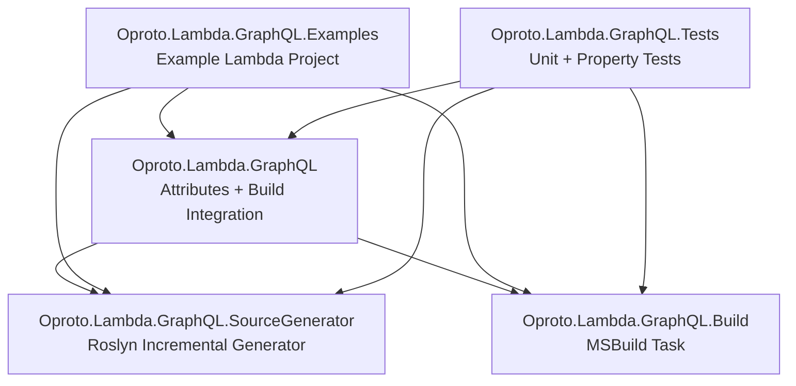

# Design Document: Oproto Rebranding

## Overview

This design covers the systematic rebranding of the Lambda.GraphQL project to Oproto.Lambda.GraphQL. The rebranding is a comprehensive rename operation that touches every layer of the project: C# namespaces, project/solution files, folder structure, NuGet package identity, MSBuild integration, documentation, CDK examples, steering files, and build configuration.

The core challenge is ensuring consistency — every reference to the old name must be updated atomically so the project compiles, tests pass, and all documentation/tooling references resolve correctly after the rename.

### Key Design Decisions

1. **Prefix-based rename**: All identifiers gain the `Oproto.` prefix (e.g., `Lambda.GraphQL` → `Oproto.Lambda.GraphQL`). This is a mechanical, prefix-prepend operation for most artifacts.
2. **Repository URL change**: `dguisinger/lambda-graphql` → `oproto/lambda-graphql` across all files.
3. **README restructure**: The README will be rewritten to match the FluentDynamoDb sister project layout (`ExampleReadme.md`), not just find-and-replace.
4. **MSBuild props/targets file rename**: The bundled build files (`Lambda.GraphQL.props`, `Lambda.GraphQL.targets`) must be renamed to `Oproto.Lambda.GraphQL.props` and `Oproto.Lambda.GraphQL.targets`, and all internal references updated.
5. **Hackathon content removal**: `DEVLOG.md` and `graphql-hackathon.md` are deleted; any remaining hackathon references in other files are removed.

## Architecture

The rebranding does not change the system architecture. The project retains its three-package structure:



### Post-Rebranding Folder Structure

```
Oproto.Lambda.GraphQL/
├── Oproto.Lambda.GraphQL/                    # Main package (attributes + build integration)
│   ├── Attributes/                           # GraphQL attribute definitions
│   └── build/                                # MSBuild props/targets (renamed files)
├── Oproto.Lambda.GraphQL.Build/              # MSBuild task for schema extraction
├── Oproto.Lambda.GraphQL.SourceGenerator/    # Roslyn incremental source generator
│   └── Models/                               # Type/Field/Resolver info models
├── Oproto.Lambda.GraphQL.Tests/              # Unit and property-based tests
├── Oproto.Lambda.GraphQL.Examples/           # Example Lambda project
├── cdk-example/                              # CDK deployment example
└── docs/                                     # Documentation
```

## Components and Interfaces

The rebranding affects the following component categories. No new components are introduced.

### 1. C# Source Files (Namespace + Using Directives)

All `.cs` files across all projects must have:
- `namespace Lambda.GraphQL...` → `namespace Oproto.Lambda.GraphQL...`
- `using Lambda.GraphQL...` → `using Oproto.Lambda.GraphQL...`

Affected projects:
- `Oproto.Lambda.GraphQL/` (attributes)
- `Oproto.Lambda.GraphQL.Build/` (MSBuild task)
- `Oproto.Lambda.GraphQL.SourceGenerator/` (source generator + models)
- `Oproto.Lambda.GraphQL.Tests/` (test files)
- `Oproto.Lambda.GraphQL.Examples/` (example Lambda functions)

### 2. Project Files (.csproj)

Each `.csproj` requires updates to:
- Filename: `Lambda.GraphQL.{Suffix}.csproj` → `Oproto.Lambda.GraphQL.{Suffix}.csproj`
- `<PackageId>`: `Lambda.GraphQL.{Suffix}` → `Oproto.Lambda.GraphQL.{Suffix}`
- `<AssemblyName>`: (add or update to `Oproto.Lambda.GraphQL.{Suffix}`)
- `<RootNamespace>`: (add or update to `Oproto.Lambda.GraphQL.{Suffix}`)
- `<ProjectReference>` paths: update to new folder/file names
- Pack paths referencing old DLL names

### 3. Solution File

`Lambda.GraphQL.sln` → `Oproto.Lambda.GraphQL.sln`
- All project paths and names within the `.sln` updated to new names

### 4. MSBuild Props/Targets

Files in `Oproto.Lambda.GraphQL/build/`:
- `Lambda.GraphQL.props` → `Oproto.Lambda.GraphQL.props`
- `Lambda.GraphQL.targets` → `Oproto.Lambda.GraphQL.targets`
- Internal references to `Lambda.GraphQL.Build.ExtractGraphQLSchemaTask` → `Oproto.Lambda.GraphQL.Build.ExtractGraphQLSchemaTask`
- DLL path references: `Lambda.GraphQL.Build.dll` → `Oproto.Lambda.GraphQL.Build.dll`
- DLL path references: `Lambda.GraphQL.SourceGenerator.dll` → `Oproto.Lambda.GraphQL.SourceGenerator.dll`
- MSBuild property names like `EnableLambdaGraphQLSchemaGeneration` remain unchanged (they are user-facing config, not branding)

### 5. Directory.Build.props

- `<Product>`: `Lambda.GraphQL` → `Oproto.Lambda.GraphQL`
- `<Authors>`: Update to reflect Oproto / Dan Guisinger
- `<Company>`: Update to `Oproto Inc`
- `<Copyright>`: Update to `Copyright © Oproto Inc`
- `<PackageProjectUrl>`: `https://github.com/aws/lambda-graphql` → `https://github.com/oproto/lambda-graphql`
- `<RepositoryUrl>`: same update

### 6. README.md

Complete rewrite following the `ExampleReadme.md` (FluentDynamoDb) template:
- Logo placeholder
- CI/CD badges pointing to `oproto/lambda-graphql`
- NuGet badges for each package (`Oproto.Lambda.GraphQL`, `Oproto.Lambda.GraphQL.Build`, `Oproto.Lambda.GraphQL.SourceGenerator`)
- About section with Oproto Inc, Dan Guisinger, links to oproto.com, oproto.io, lambdagraphql.dev
- Related Projects section (FluentDynamoDb, LambdaOpenApi)
- Sponsorship section (GitHub Sponsors, Buy Me a Coffee)
- Community & Support section (GitHub Issues/Discussions under `oproto/lambda-graphql`)
- All hackathon references removed
- Technical content preserved but updated to use `Oproto.Lambda.GraphQL` naming

### 7. Documentation (docs/)

All markdown files in `docs/` updated:
- `Lambda.GraphQL` → `Oproto.Lambda.GraphQL` in text and code examples
- `dguisinger/lambda-graphql` → `oproto/lambda-graphql` in URLs
- Hackathon references removed

### 8. CDK Example

- `cdk-example/README.md`: all `Lambda.GraphQL` references updated
- `cdk-example/src/graphql-api-stack.ts`: assembly handler name `Lambda.GraphQL.Examples` → `Oproto.Lambda.GraphQL.Examples`
- `cdk-example/src/app.ts`: description string updated

### 9. Steering Files

- `.kiro/steering/product.md`: `Lambda.GraphQL` → `Oproto.Lambda.GraphQL`
- `.kiro/steering/structure.md`: folder names and project names updated
- `.kiro/steering/tech.md`: solution file name and build commands updated

### 10. Hackathon File Deletion

- Delete `DEVLOG.md`
- Delete `graphql-hackathon.md`

## Data Models

No data model changes. The rebranding is purely a naming/identity operation. The GraphQL schema output format (`schema.graphql`), resolver manifest format (`resolvers.json`), and all runtime data structures remain identical.

The only "data" affected is string content within:
- C# source code (namespaces, using directives, string literals referencing assembly names)
- XML/JSON configuration files (csproj, sln, props, nuget.config)
- Markdown documentation
- TypeScript CDK code (assembly name strings)


## Correctness Properties

*A property is a characteristic or behavior that should hold true across all valid executions of a system — essentially, a formal statement about what the system should do. Properties serve as the bridge between human-readable specifications and machine-verifiable correctness guarantees.*

### Property 1: No stale name references in repository files

*For any* text file in the repository (excluding `.git/`, binary files, and the `ExampleReadme.md` template), the file shall not contain the string `Lambda.GraphQL` unless it is preceded by `Oproto.` (i.e., the bare old name must not appear). This covers C# namespace declarations (1.1), using directives (1.2), csproj ProjectReference paths (2.3), PackageId/AssemblyName/RootNamespace elements (4.1, 4.2, 4.3), documentation text and code examples (6.1, 6.4), and CDK example references (9.1, 9.2).

**Validates: Requirements 1.1, 1.2, 2.3, 4.1, 4.2, 4.3, 6.1, 6.4, 9.1, 9.2**

### Property 2: No old GitHub URL references

*For any* text file in the repository (excluding `.git/`), the file shall not contain the string `dguisinger/lambda-graphql`. All GitHub URLs must reference `oproto/lambda-graphql`.

**Validates: Requirements 6.2, 8.1, 8.2**

### Property 3: No hackathon references

*For any* text file in the repository (excluding `.git/`), the file shall not contain the case-insensitive string `hackathon`.

**Validates: Requirements 5.7, 6.3, 7.3**

## Error Handling

This rebranding is a one-time migration operation, not a runtime system. Error handling focuses on ensuring the rename is complete and consistent:

1. **Incomplete renames**: If any file still contains the old name pattern after the rebranding tasks are complete, the correctness properties (Property 1, 2, 3) will catch it. The build will also fail if project references are inconsistent.

2. **Build failures after rename**: The solution must compile after all renames. If namespace renames are incomplete or project references are stale, `dotnet build Oproto.Lambda.GraphQL.sln` will produce compilation errors that pinpoint the issue.

3. **MSBuild task resolution failures**: The `.targets` file uses multiple fallback paths to locate `Oproto.Lambda.GraphQL.Build.dll`. If the DLL name isn't updated in all fallback conditions, the post-build schema extraction will fail with a clear MSBuild error.

4. **NuGet pack failures**: If `<PackageId>` or pack paths reference old DLL names, `dotnet pack` will fail. This is caught by running `dotnet pack` as a verification step.

## Testing Strategy

### Dual Testing Approach

Both unit tests and property-based tests are used. For a rebranding operation, the property-based tests are particularly valuable because they sweep the entire repository for stale references.

### Property-Based Tests (FsCheck.Xunit)

Each correctness property is implemented as a single property-based test. The tests enumerate all text files in the repository and verify the property holds for each one.

- Library: **FsCheck.Xunit** (already in the project)
- Minimum iterations: 100 per property test
- Each test is tagged with a comment referencing the design property

Tag format:
- `// Feature: oproto-rebranding, Property 1: No stale name references in repository files`
- `// Feature: oproto-rebranding, Property 2: No old GitHub URL references`
- `// Feature: oproto-rebranding, Property 3: No hackathon references`

### Unit Tests (xUnit + FluentAssertions)

Unit tests cover the concrete example-based acceptance criteria:

- **File existence checks**: Verify old folders/files don't exist, new ones do (Requirements 2.1, 2.2, 3.1–3.5, 7.1, 7.2)
- **Solution file content**: Verify `.sln` references new project paths (Requirement 2.4)
- **Build verification**: `dotnet build Oproto.Lambda.GraphQL.sln` succeeds (Requirements 1.3, 2.5)
- **README content checks**: Verify presence of Oproto branding elements, About section, Related Projects, sponsorship, Community & Support (Requirements 5.2–5.6)
- **CDK assembly name**: Verify `graphql-api-stack.ts` handler references `Oproto.Lambda.GraphQL.Examples` (Requirement 9.3)
- **Steering file content**: Verify each steering file references new names (Requirements 10.1–10.3)
- **Build config content**: Verify `Directory.Build.props` has updated product/company/URL fields (Requirement 11.1)
- **MSBuild props/targets**: Verify renamed files exist and reference new DLL names (Requirement 4.4)
