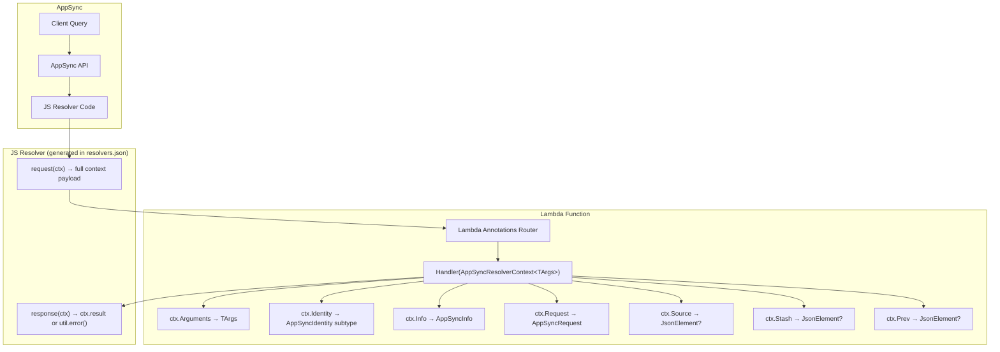
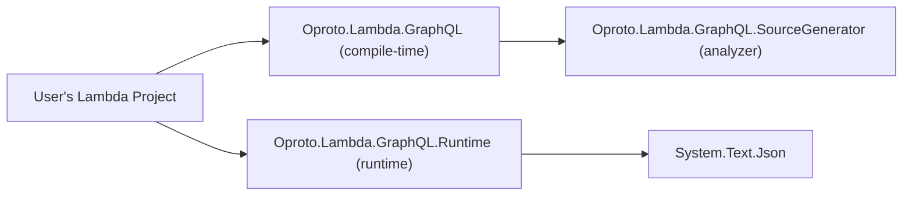
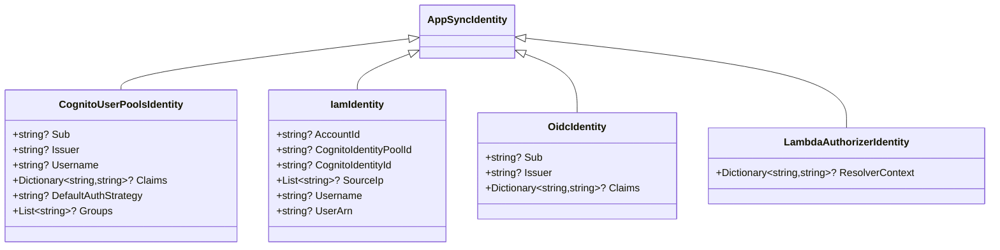

# Design Document: Runtime Core — AppSync Resolver Context

## Overview

This design covers the foundational runtime library for Oproto.Lambda.GraphQL: the `Oproto.Lambda.GraphQL.Runtime` package. The package provides typed C# models for deserializing the full AppSync resolver context in Lambda functions, replacing the current arguments-only payload pattern.

The scope includes:
1. A new `Oproto.Lambda.GraphQL.Runtime` project (net8.0;net10.0) with typed models
2. `AppSyncResolverContext<TArguments>` as the primary entry point for Lambda functions
3. Polymorphic identity models for Cognito, IAM, OIDC, and Lambda authorizer auth modes
4. AOT-compatible JSON deserialization via `System.Text.Json` source generators
5. Source generator changes to emit full-context JS resolver code in `resolvers.json`
6. CDK example updates to consume the new `resolverCode` property from the manifest

### Key Design Decisions

- **Always send full context**: The JS resolver code always sends the complete AppSync context (arguments, source, identity, info, request, stash, prev) as the Lambda payload. No more `usesLambdaContext` flag.
- **Plain POCO model**: `AppSyncResolverContext<TArguments>` is a simple class that `System.Text.Json` can deserialize directly. Lambda Annotations passes the entire payload through as a single parameter.
- **Stream fallback**: If Lambda Annotations doesn't cooperate with single complex parameter deserialization, a `DeserializeFromStream` helper method provides a reliable fallback.
- **Discriminated identity deserialization**: A custom `JsonConverter` inspects JSON property names to determine which identity subtype to instantiate, avoiding reflection.
- **camelCase by default**: All JSON property names use camelCase to match the AppSync payload format.

## Architecture



### Package Dependency Graph



### JS Resolver Payload Shape

The source generator emits JS resolver code that constructs this payload:

```json
{
  "arguments": { "id": "123" },
  "source": { "parentField": "value" },
  "identity": {
    "sub": "user-uuid",
    "issuer": "https://cognito-idp...",
    "username": "john",
    "claims": { "email": "john@example.com" },
    "defaultAuthStrategy": "ALLOW",
    "groups": ["admin"]
  },
  "info": {
    "fieldName": "getProduct",
    "parentTypeName": "Query",
    "selectionSetList": ["id", "name", "category/name"],
    "selectionSetGraphQL": "{ id name category { name } }"
  },
  "request": {
    "headers": {
      "authorization": "Bearer ...",
      "x-custom-header": "value"
    }
  },
  "stash": {},
  "prev": null
}
```

## Components and Interfaces

### 1. Runtime Package (`Oproto.Lambda.GraphQL.Runtime`)

**Project Configuration:**
- Target frameworks: `net8.0;net10.0`
- Namespace: `Oproto.Lambda.GraphQL.Runtime`
- Dependencies: `System.Text.Json` (framework-provided, no extra NuGet needed)
- No dependency on reflection-based serialization

**Public API Surface:**

#### `AppSyncResolverContext<TArguments>`

The primary model class. A generic POCO that maps to the full AppSync context payload.

```csharp
namespace Oproto.Lambda.GraphQL.Runtime;

public class AppSyncResolverContext<TArguments>
{
    public TArguments? Arguments { get; set; }
    public JsonElement? Source { get; set; }
    public AppSyncIdentity? Identity { get; set; }
    public AppSyncInfo? Info { get; set; }
    public AppSyncRequest? Request { get; set; }
    public JsonElement? Stash { get; set; }
    public JsonElement? Prev { get; set; }
}
```

#### Identity Type Hierarchy



#### `AppSyncInfo`

```csharp
public class AppSyncInfo
{
    public string? FieldName { get; set; }
    public string? ParentTypeName { get; set; }
    public List<string>? SelectionSetList { get; set; }
    public string? SelectionSetGraphQL { get; set; }
}
```

#### `AppSyncRequest`

```csharp
public class AppSyncRequest
{
    public Dictionary<string, string>? Headers { get; set; }
}
```

#### `AppSyncIdentityConverter` (Custom JsonConverter)

A `JsonConverter<AppSyncIdentity>` that inspects the JSON properties to determine the correct subtype:

| Discriminating Property | Identity Type |
|------------------------|---------------|
| `resolverContext` present | `LambdaAuthorizerIdentity` |
| `cognitoIdentityPoolId` or `userArn` present | `IamIdentity` |
| `defaultAuthStrategy` or `groups` present | `CognitoUserPoolsIdentity` |
| `sub` and `issuer` present (fallback) | `OidcIdentity` |
| None match / empty object | `AppSyncIdentity` (base) |

The converter reads the JSON into a `JsonDocument`, inspects property names, then deserializes into the appropriate subtype. This avoids reflection and is AOT-compatible since all subtypes are known at compile time.

#### `AppSyncResolverContextJsonSerializerContext`

A `JsonSerializerContext` subclass with `[JsonSerializable]` attributes for all public model types, enabling AOT-compatible serialization:

```csharp
[JsonSourceGenerationOptions(
    PropertyNamingPolicy = JsonKnownNamingPolicy.CamelCase,
    DefaultIgnoreCondition = JsonIgnoreCondition.WhenWritingNull)]
[JsonSerializable(typeof(AppSyncResolverContext<JsonElement>))]
[JsonSerializable(typeof(AppSyncIdentity))]
[JsonSerializable(typeof(CognitoUserPoolsIdentity))]
[JsonSerializable(typeof(IamIdentity))]
[JsonSerializable(typeof(OidcIdentity))]
[JsonSerializable(typeof(LambdaAuthorizerIdentity))]
[JsonSerializable(typeof(AppSyncInfo))]
[JsonSerializable(typeof(AppSyncRequest))]
public partial class AppSyncResolverContextJsonSerializerContext : JsonSerializerContext
{
}
```

**Note:** The `JsonSerializerContext` above handles the built-in types. For user-specific `TArguments` types, users must create their own `JsonSerializerContext` with `[JsonSerializable(typeof(AppSyncResolverContext<MyArgs>))]` and pass it to the convenience deserialize method. The runtime provides a generic `Deserialize<TArguments>` helper that accepts a `JsonSerializerOptions` or `JsonTypeInfo` parameter.

#### Convenience Deserialization Methods

```csharp
public static class AppSyncResolverContextSerializer
{
    /// <summary>
    /// Deserializes an AppSync resolver context from a JSON string.
    /// </summary>
    public static AppSyncResolverContext<TArguments>? Deserialize<TArguments>(
        string json, JsonSerializerOptions? options = null);

    /// <summary>
    /// Deserializes an AppSync resolver context from a Stream (for Lambda Annotations fallback).
    /// </summary>
    public static AppSyncResolverContext<TArguments>? Deserialize<TArguments>(
        Stream stream, JsonSerializerOptions? options = null);

    /// <summary>
    /// Deserializes using a specific JsonTypeInfo for AOT scenarios.
    /// </summary>
    public static AppSyncResolverContext<TArguments>? Deserialize<TArguments>(
        string json, JsonTypeInfo<AppSyncResolverContext<TArguments>> jsonTypeInfo);

    /// <summary>
    /// Returns pre-configured JsonSerializerOptions with camelCase naming
    /// and the AppSyncIdentityConverter registered.
    /// </summary>
    public static JsonSerializerOptions DefaultOptions { get; }
}
```

### 2. Source Generator Changes

#### Resolver Manifest Updates

The `ResolverManifestGenerator` is updated to:

1. **Add `resolverCode` property** to each unit resolver entry containing inline JS request/response handlers
2. **Remove `usesLambdaContext` flag** since all resolvers now send full context
3. **Generate consistent JS resolver code** for all unit resolvers

The generated JS resolver code for each unit resolver:

```javascript
export function request(ctx) {
  return {
    operation: 'Invoke',
    payload: {
      arguments: ctx.arguments,
      source: ctx.source,
      identity: ctx.identity,
      info: ctx.info,
      request: ctx.request,
      stash: ctx.stash,
      prev: ctx.prev
    }
  };
}
export function response(ctx) {
  if (ctx.error) {
    util.error(ctx.error.message, ctx.error.type);
  }
  return ctx.result;
}
```

#### ResolverInfo Model Changes

- Remove `UsesLambdaContext` property from `ResolverInfo`
- The `resolverCode` is generated at manifest emission time, not stored on the model

#### Updated resolvers.json Format

```json
{
  "resolvers": [
    {
      "typeName": "Query",
      "fieldName": "getProduct",
      "kind": "UNIT",
      "dataSource": "GetProductDataSource",
      "lambdaFunctionName": "GetProduct",
      "lambdaFunctionLogicalId": "GetProductFunction",
      "resolverCode": "export function request(ctx) { return { operation: 'Invoke', payload: { arguments: ctx.arguments, source: ctx.source, identity: ctx.identity, info: ctx.info, request: ctx.request, stash: ctx.stash, prev: ctx.prev } }; }\nexport function response(ctx) { if (ctx.error) { util.error(ctx.error.message, ctx.error.type); } return ctx.result; }"
    }
  ]
}
```

### 3. CDK Example Updates

The CDK stack is updated to:

1. **Read `resolverCode` from manifest** instead of generating inline JS
2. **Remove the `usesLambdaContext` conditional logic** 
3. **Update Lambda runtime** from `DOTNET_6` to `DOTNET_8`

```typescript
// Updated resolver creation
new appsync.Resolver(this, `${config.typeName}${config.fieldName}Resolver`, {
  api,
  typeName: config.typeName,
  fieldName: config.fieldName,
  dataSource,
  runtime: appsync.FunctionRuntime.JS_1_0_0,
  code: appsync.Code.fromInline(config.resolverCode),
});
```


## Data Models

### AppSync Resolver Context Payload

The full payload sent from the JS resolver to the Lambda function:

| Property | Type | Required | Description |
|----------|------|----------|-------------|
| `arguments` | `TArguments` | Yes | GraphQL arguments, deserialized into the generic type parameter |
| `source` | `JsonElement?` | No | Parent object for nested/field resolvers |
| `identity` | `AppSyncIdentity?` | No | Caller identity (polymorphic based on auth mode) |
| `info` | `AppSyncInfo?` | No | GraphQL field info including selection sets |
| `request` | `AppSyncRequest?` | No | HTTP request metadata (headers) |
| `stash` | `JsonElement?` | No | Pipeline resolver stash data |
| `prev` | `JsonElement?` | No | Previous pipeline function result |

### Identity Subtypes

#### CognitoUserPoolsIdentity

| Property | Type | Description |
|----------|------|-------------|
| `sub` | `string?` | Cognito user pool subject UUID |
| `issuer` | `string?` | Token issuer URL |
| `username` | `string?` | Cognito username |
| `claims` | `Dictionary<string, string>?` | JWT claims |
| `defaultAuthStrategy` | `string?` | Default auth strategy (ALLOW/DENY) |
| `groups` | `List<string>?` | Cognito user groups |

#### IamIdentity

| Property | Type | Description |
|----------|------|-------------|
| `accountId` | `string?` | AWS account ID |
| `cognitoIdentityPoolId` | `string?` | Cognito identity pool ID (federated) |
| `cognitoIdentityId` | `string?` | Cognito identity ID (federated) |
| `sourceIp` | `List<string>?` | Source IP addresses |
| `username` | `string?` | IAM username or role session name |
| `userArn` | `string?` | Full IAM ARN |

#### OidcIdentity

| Property | Type | Description |
|----------|------|-------------|
| `sub` | `string?` | OIDC subject |
| `issuer` | `string?` | OIDC issuer URL |
| `claims` | `Dictionary<string, string>?` | OIDC token claims |

#### LambdaAuthorizerIdentity

| Property | Type | Description |
|----------|------|-------------|
| `resolverContext` | `Dictionary<string, string>?` | Key-value pairs from Lambda authorizer response |

### AppSyncInfo

| Property | Type | Description |
|----------|------|-------------|
| `fieldName` | `string?` | The GraphQL field being resolved |
| `parentTypeName` | `string?` | The parent type (Query, Mutation, or custom type) |
| `selectionSetList` | `List<string>?` | Flattened list of requested fields (e.g., `["id", "name", "category/name"]`) |
| `selectionSetGraphQL` | `string?` | Raw GraphQL selection set text |

### AppSyncRequest

| Property | Type | Description |
|----------|------|-------------|
| `headers` | `Dictionary<string, string>?` | HTTP request headers from the client |

### Resolver Manifest Entry (Updated)

| Property | Type | Required | Description |
|----------|------|----------|-------------|
| `typeName` | `string` | Yes | GraphQL type (Query, Mutation, Subscription) |
| `fieldName` | `string` | Yes | GraphQL field name |
| `kind` | `string` | Yes | UNIT or PIPELINE |
| `dataSource` | `string` | Unit only | Data source name |
| `lambdaFunctionName` | `string` | Unit only | Lambda function name |
| `lambdaFunctionLogicalId` | `string` | Unit only | CloudFormation logical ID |
| `resolverCode` | `string` | Unit only | **NEW** — Inline JS resolver request/response handler code |
| `memorySize` | `int?` | No | Lambda memory size |
| `timeout` | `int?` | No | Lambda timeout in seconds |
| `resourceName` | `string?` | No | Lambda Annotations resource name |
| `role` | `string?` | No | IAM role ARN |
| `policies` | `string[]?` | No | IAM policy ARNs |

**Removed:** `usesLambdaContext` — no longer needed since all resolvers send full context.


## Correctness Properties

*A property is a characteristic or behavior that should hold true across all valid executions of a system — essentially, a formal statement about what the system should do. Properties serve as the bridge between human-readable specifications and machine-verifiable correctness guarantees.*

### Property 1: Context model round-trip serialization

*For any* valid `AppSyncResolverContext<TArguments>` instance with arbitrary arguments, source, identity (of any subtype), info (with any selection set list), request (with any headers), stash, and prev values, serializing to JSON and then deserializing back SHALL produce an object with equivalent property values.

**Validates: Requirements 2.2, 2.3, 2.4, 2.5, 2.7, 4.2, 4.3**

### Property 2: Missing optional properties default to null

*For any* subset of the optional context properties (source, identity, info, request, stash, prev), when a JSON payload contains only the `arguments` field and the selected subset of optional properties, deserializing SHALL produce an `AppSyncResolverContext<TArguments>` where all omitted properties are null and all included properties are correctly populated.

**Validates: Requirements 2.6**

### Property 3: Identity polymorphic deserialization preserves concrete type

*For any* identity instance of type `CognitoUserPoolsIdentity`, `IamIdentity`, `OidcIdentity`, or `LambdaAuthorizerIdentity` with arbitrary valid property values, serializing the identity to JSON and deserializing it through the `AppSyncIdentityConverter` SHALL produce an object of the same concrete type with equivalent property values.

**Validates: Requirements 3.6, 3.7, 3.8, 3.9**

### Property 4: Serialized JSON uses camelCase property names

*For any* valid `AppSyncResolverContext<TArguments>` instance, serializing to JSON using the runtime's default options SHALL produce a JSON string where every property name at every nesting level is in camelCase format (first character lowercase).

**Validates: Requirements 6.3**

### Property 5: All unit resolvers emit full-context resolverCode

*For any* collection of `ResolverInfo` entries where at least one has `Kind == Unit`, generating the resolver manifest SHALL produce JSON where every unit resolver entry contains a `resolverCode` property that includes all seven context fields (arguments, source, identity, info, request, stash, prev) in the payload, and no resolver entry contains a `usesLambdaContext` property.

**Validates: Requirements 7.1, 7.2, 7.3**

## Error Handling

### Deserialization Errors

| Scenario | Behavior |
|----------|----------|
| Malformed JSON | `JsonException` thrown by `System.Text.Json` — not caught by the runtime |
| Unknown identity shape (no discriminating properties) | Deserialize as base `AppSyncIdentity` with no subtype-specific properties |
| `arguments` field missing | `Arguments` property is `default(TArguments)` (null for reference types) |
| Extra/unknown JSON properties | Ignored by default (`System.Text.Json` behavior) |
| Type mismatch in `TArguments` | `JsonException` thrown — caller must handle |

### Identity Converter Error Handling

The `AppSyncIdentityConverter` uses a defensive approach:
1. Read the identity JSON into a `JsonElement`
2. Check for discriminating properties in priority order (resolverContext → cognitoIdentityPoolId/userArn → defaultAuthStrategy/groups → sub+issuer)
3. If no discriminating properties match, return a base `AppSyncIdentity` instance
4. If deserialization of the chosen subtype fails, let the `JsonException` propagate

### Source Generator Error Handling

The source generator already has established error handling patterns using `DiagnosticDescriptors`. The resolver code generation follows the same pattern — if a resolver entry is malformed, a diagnostic is reported and the resolver is skipped.

## Testing Strategy

### Testing Framework

- **Unit tests**: xUnit with FluentAssertions
- **Property-based tests**: FsCheck.Xunit (already used in the project)
- **Test project**: `Oproto.Lambda.GraphQL.Tests` (existing, will add runtime tests)

### Dual Testing Approach

Unit tests and property-based tests are complementary:

- **Unit tests** verify specific examples, edge cases, and error conditions:
  - Deserialization of each identity subtype from realistic AppSync JSON payloads
  - Missing optional properties (source, identity, info, request, stash, prev absent)
  - Empty headers dictionary
  - Nested selection set paths in `SelectionSetList`
  - AOT-compatible deserialization using the provided `JsonSerializerContext`
  - Resolver manifest format validation (resolverCode present, usesLambdaContext absent)

- **Property-based tests** verify universal properties across all inputs:
  - Each correctness property above maps to exactly one property-based test
  - Minimum 100 iterations per property test
  - Each test is tagged with a comment referencing the design property

### Property Test Configuration

Each property-based test MUST:
- Run a minimum of 100 iterations
- Reference its design document property in a comment tag
- Tag format: `Feature: runtime-core-appsync-context, Property {number}: {property_text}`

### FsCheck Generators

Custom FsCheck `Arbitrary` instances are needed for:

- `AppSyncResolverContext<TArguments>` — generates random contexts with all property combinations
- `AppSyncIdentity` subtypes — generates random instances of each identity subtype
- `AppSyncInfo` — generates random field names, parent type names, and selection set lists (including nested paths like `"category/name"`)
- `AppSyncRequest` — generates random header dictionaries
- `ResolverInfo` — generates random unit and pipeline resolver configurations

### Test Organization

```
Oproto.Lambda.GraphQL.Tests/
├── Runtime/
│   ├── AppSyncResolverContextTests.cs          # Unit tests for context deserialization
│   ├── AppSyncIdentityConverterTests.cs        # Unit tests for identity polymorphism
│   ├── AppSyncResolverContextPropertyTests.cs  # Property-based tests (Properties 1-4)
│   └── Generators/
│       └── AppSyncArbitraries.cs               # FsCheck generators for runtime types
├── ResolverManifestTests.cs                    # Existing + new tests for resolverCode (Property 5)
└── ...existing test files...
```

### Property-to-Test Mapping

| Property | Test Class | Test Method |
|----------|-----------|-------------|
| Property 1: Round-trip serialization | `AppSyncResolverContextPropertyTests` | `RoundTrip_SerializeDeserialize_ProducesEquivalentObject` |
| Property 2: Missing optional properties | `AppSyncResolverContextPropertyTests` | `MissingOptionalProperties_DefaultToNull` |
| Property 3: Identity polymorphic deserialization | `AppSyncResolverContextPropertyTests` | `IdentityRoundTrip_PreservesConcreteType` |
| Property 4: camelCase property names | `AppSyncResolverContextPropertyTests` | `Serialization_ProducesCamelCasePropertyNames` |
| Property 5: Unit resolvers emit resolverCode | `ResolverManifestTests` | `AllUnitResolvers_ContainFullContextResolverCode` |
